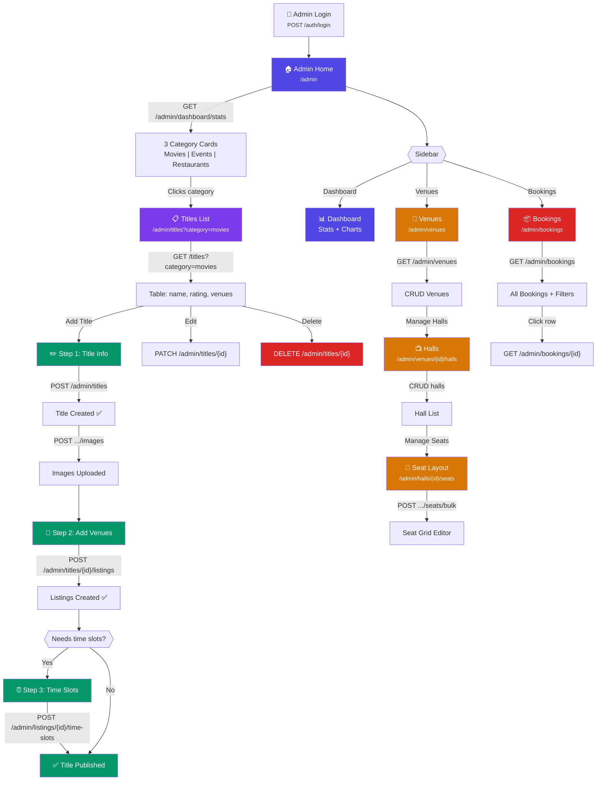

```mermaid
    flowchart TD
        A_LOGIN["🔑 Admin Login<br/><small>POST /auth/login</small>"]
        A_LOGIN --> A_HOME["🏠 Admin Home<br/><small>/admin</small>"]
        A_HOME -- "GET /admin/dashboard/stats" --> CARDS["3 Category Cards<br/>Movies | Events | Restaurants"]
        A_HOME --> SIDEBAR{{"Sidebar"}}
        SIDEBAR -- "Dashboard" --> DASH["📊 Dashboard<br/>Stats + Charts"]
        SIDEBAR -- "Venues" --> VENUES
        SIDEBAR -- "Bookings" --> A_BOOK
        CARDS -- "Clicks category" --> LIST["📋 Titles List<br/><small>/admin/titles?category=movies</small>"]
        LIST -- "GET /titles?category=movies" --> TABLE["Table: name, rating, venues"]
        TABLE -- "Add Title" --> W1
        TABLE -- "Edit" --> W1_EDIT["PATCH /admin/titles/{id}"]
        TABLE -- "Delete" --> DEL["DELETE /admin/titles/{id}"]
        W1["✏️ Step 1: Title Info"]
        W1 -- "POST /admin/titles" --> CREATED["Title Created ✅"]
        CREATED -- "POST .../images" --> IMG["Images Uploaded"]
        IMG --> W2
        W2["🏢 Step 2: Add Venues"]
        W2 -- "POST /admin/titles/{id}/listings" --> LISTINGS["Listings Created ✅"]
        LISTINGS --> SLOTS_Q{{"Needs time slots?"}}
        SLOTS_Q -- "Yes" --> W3
        SLOTS_Q -- "No" --> DONE["✅ Title Published"]
        W3["⏰ Step 3: Time Slots"]
        W3 -- "POST /admin/listings/{id}/time-slots" --> DONE
        VENUES["🏢 Venues<br/><small>/admin/venues</small>"]
        VENUES -- "GET /admin/venues" --> V_TABLE["CRUD Venues"]
        V_TABLE -- "Manage Halls" --> HALLS
        HALLS["📺 Halls<br/><small>/admin/venues/{id}/halls</small>"]
        HALLS -- "CRUD halls" --> H_TABLE["Hall List"]
        H_TABLE -- "Manage Seats" --> SEATS
        SEATS["💺 Seat Layout<br/><small>/admin/halls/{id}/seats</small>"]
        SEATS -- "POST .../seats/bulk" --> GRID["Seat Grid Editor"]
        A_BOOK["📦 Bookings<br/><small>/admin/bookings</small>"]
        A_BOOK -- "GET /admin/bookings" --> B_TABLE["All Bookings + Filters"]
        B_TABLE -- "Click row" --> B_DETAIL["GET /admin/bookings/{id}"]
        style A_HOME fill:#4F46E5,color:#fff
        style DASH fill:#4F46E5,color:#fff
        style LIST fill:#7C3AED,color:#fff
        style W1 fill:#059669,color:#fff
        style W2 fill:#059669,color:#fff
        style W3 fill:#059669,color:#fff
        style DONE fill:#059669,color:#fff
        style VENUES fill:#D97706,color:#fff
        style HALLS fill:#D97706,color:#fff
        style SEATS fill:#D97706,color:#fff
        style A_BOOK fill:#DC2626,color:#fff
        style DEL fill:#DC2626,color:#fff
```