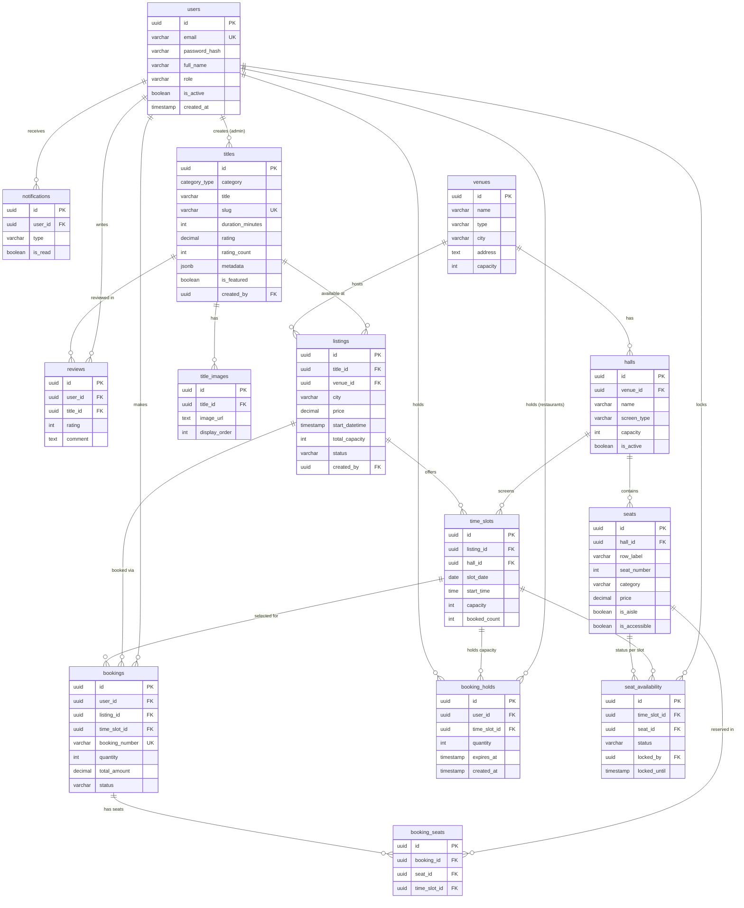
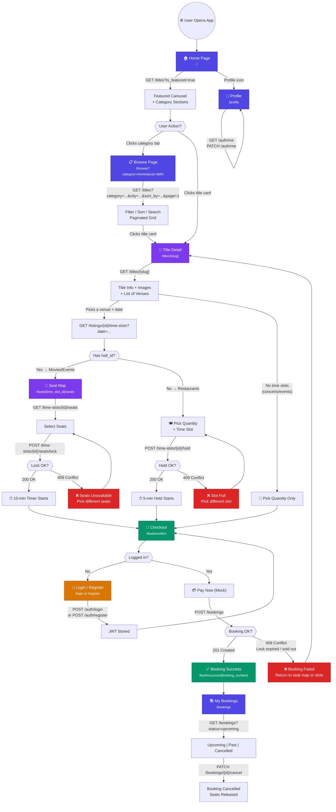
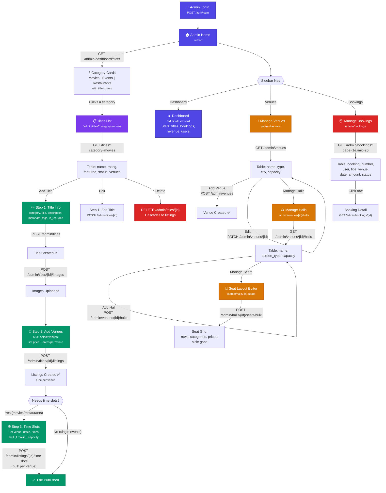

## Flow Diagrams

### 🗂️ Entity Relationship Diagram (ERD)

---

### 👤 Regular User Flow

> **Color key:** 🟦 Blue = Browse screens · 🟪 Purple = Detail/selection · 🟩 Green = Booking success · 🟧 Orange = Auth · 🟥 Red = Errors

---

### 🛡️ Admin Flow

> **Color key:** 🟦 Blue = Navigation/Dashboard · 🟪 Purple = Title management · 🟩 Green = 3-step creation wizard · 🟧 Orange = Venue/Hall/Seat setup · 🟥 Red = Bookings/Delete
